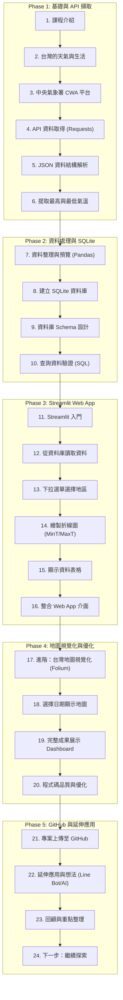

# 🌤️ AI 創新微課程：Taiwan Weather Forecast
> **從氣象資料到互動式天氣預報應用**  
> *CWA API × JSON × Python × SQLite × Streamlit × Folium*

---

## 📌 專案簡介 (Overview)
本專案為 AIoT 課程 Lesson 3 作業實作，以中央氣象署 (CWA) Open Data 為核心，透過 Python 擷取氣象資料、經由 SQLite 儲存與處理，最終利用 Streamlit 與 Folium 建構出互動式的台灣天氣預報儀表板與視覺化地圖。

---

## 🛠️ 技術架構 (Technology Stack)
- **程式語言**：Python 3.x
- **資料來源**：中央氣象署 CWA Open Data API (JSON)
- **資料庫**：SQLite 3 (`data.db`)
- **資料處理**：Pandas, Requests
- **前端與 Web 應用**：Streamlit
- **地圖視覺化**：Folium / `streamlit-folium`
- **版本控制**：Git & GitHub

---

## 🗺️ 專案開發與學習工作流 (24 步驟學習地圖)



---

### 📋 詳細 24 步驟說明

#### 🔹 第一階段：基礎與 API 資料擷取 (Steps 1 ~ 6)
1. **課程介紹**：AI × 資料 × 天氣 × 實作目標與學習地圖介紹。
2. **台灣的天氣與生活**：探索天氣對生活的影響、資料驅動決策與智慧應用案例。
3. **中央氣象署 CWA**：註冊 CWA Open Data 平台，取得 API Key 並選擇氣象資料集。
4. **API 資料取得**：使用 `requests` 套件發送 HTTP 請求取得 JSON 格式資料。
   ```python
   import requests
   url = "https://opendata.cwa.gov.tw/api/v1/rest/datastore/F-C0032-001"
   headers = {"Authorization": "YOUR_CWA_API_KEY"}
   resp = requests.get(url, headers=headers)
   data = resp.json()
   ```
5. **JSON 資料結構解析**：尋找氣溫資料位置，定位區域 (`locationName`) 與氣溫元素 (`MinT`, `MaxT`)。
6. **提取最高與最低氣溫**：進行資料分析與處理，提取 MinT 與 MaxT 並轉換為結構化資料。

---

#### 🔹 第二階段：資料整理與 SQLite 資料庫 (Steps 7 ~ 10)
7. **資料整理與預覽**：使用 `pandas` 觀察並整理資料（欄位：`regionName`, `dataDate`, `minT`, `maxT`）。
8. **建立 SQLite 資料庫**：建立本地資料庫 `data.db`，創建資料表並插入氣溫資料。
9. **資料庫設計**：設計 `TemperatureForecasts` 表格結構。
   ```sql
   CREATE TABLE TemperatureForecasts (
       id INTEGER PRIMARY KEY AUTOINCREMENT,
       regionName TEXT,
       dataDate TEXT,
       minT REAL,
       maxT REAL
   );
   ```
10. **查詢資料驗證**：使用 SQL 檢查與驗證資料庫中的資料內容。
    ```sql
    SELECT DISTINCT regionName FROM TemperatureForecasts;
    SELECT * FROM TemperatureForecasts WHERE regionName = '中部地區';
    ```

---

#### 🔹 第三階段：Streamlit 互動式 Web App (Steps 11 ~ 16)
11. **Streamlit 入門**：快速建立 Web App 環境，編寫基本結構與 Hello World。
12. **從資料庫讀取資料**：透過 SQL 查詢自 `data.db` 讀取氣溫資料至 Pandas DataFrame。
    ```python
    import sqlite3
    import pandas as pd

    conn = sqlite3.connect("data.db")
    df = pd.read_sql_query("SELECT * FROM TemperatureForecasts", conn)
    ```
13. **下拉選單選擇地區**：提供互動式 Selectbox 操作選單（北部地區、南部地區、東北部地區等）。
14. **繪製折線圖**：繪製一週最高（MaxT 紅線）與最低（MinT 藍線）氣溫趨勢圖。
15. **顯示資料表格**：以表格清晰呈現該地區一週的詳細氣溫預報。
16. **整合 Web App 介面**：完成選地區看氣溫預報的 Taiwan Weather Forecast 整體介面。

---

#### 🔹 第四階段：地圖視覺化與程式優化 (Steps 17 ~ 20)
17. **進階：台灣地圖視覺化**：結合 `Folium` 與 `Streamlit`，利用溫度區間顏色呈現台灣氣溫地圖。
18. **選擇日期顯示地圖**：提供日期選擇功能，於互動式地圖中顯示特定日期的區域溫差（如中部地區 Min: 20°C, Max: 30°C）。
19. **完整成果展示**：整合地圖與圖表，完成 Taiwan Weather Dashboard。
20. **程式碼品質與優化**：
    - 程式碼結構清晰化
    - 健全的錯誤處理機制 (Error Handling)
    - 實作 Idempotency (重複執行不重複插入資料)
    - 撰寫良好的程式碼註解

---

#### 🔹 第五階段：GitHub 發布與未來延伸 (Steps 21 ~ 24)
21. **專案上傳至 GitHub**：建立 Git Repository、連結遠端並執行 Commit & Push 進行版本管理。
22. **延伸應用與想法**：
    - 天氣提醒 Line Bot 機器人
    - 旅遊行程規劃與建議
    - 農業與防災應對應用
    - 結合 LLM / AI 進行智慧氣象分析
23. **回顧與重點整理**：複習 API 取得、JSON 解析、SQLite 資料庫、Streamlit Web App 與 AI × Coding 實作流程。
24. **下一步：繼續探索**：深入探索更多公開資料 API，打造更多 AI × Data 實體領域應用。

---

## 🚀 快速開始 (Getting Started)

### 1. 複製專案
```bash
git clone https://github.com/Richard5007/AIoT_L3_CWA_HW1.git
cd AIoT_L3_CWA_HW1
```

### 2. 安裝必要套件
```bash
pip install requests pandas streamlit folium streamlit-folium
```

### 3. 啟動 Web 應用程式
```bash
streamlit run app.py
```

---

## 📜 授權條款 (License)
MIT License
