# 📘 Taiwan Weather Forecast 專案詳細工作流程手冊 (workflow.md)

> 本文件完整記錄「AI 創新微課程：Taiwan Weather Forecast（從氣象資料到互動式天氣預報應用）」全 24 步驟之開發流程、技術細節、資料庫 Schema 與程式碼實作指引。

---

## 📐 系統開發工作流架構總覽 (Architecture Overview)

```mermaid
flowchart TD
    subgraph Phase1["Phase 1: 氣象資料擷取與解析 (Steps 1-6)"]
        S1["1. 課程介紹"] --> S2["2. 台灣氣象與生活"]
        S2 --> S3["3. CWA Open Data 平台註冊"]
        S3 --> S4["4. Requests API 請求"]
        S4 --> S5["5. JSON 階層結構解析"]
        S5 --> S6["6. 提取 MinT / MaxT 數據"]
    end

    subgraph Phase2["Phase 2: 資料清洗與 SQLite 資料庫 (Steps 7-10)"]
        S6 --> S7["7. Pandas 資料整理與轉型"]
        S7 --> S8["8. SQLite 資料庫建立 (data.db)"]
        S8 --> S9["9. Schema 設計 (TemperatureForecasts)"]
        S9 --> S10["10. SQL 語法驗證與查詢"]
    end

    subgraph Phase3["Phase 3: Streamlit 互動 Web 應用 (Steps 11-16)"]
        S10 --> S11["11. Streamlit 環境準備與入門"]
        S11 --> S12["12. SQLite 資料讀取至 DataFrame"]
        S12 --> S13["13. 地區選擇互動下拉選單"]
        S13 --> S14["14. 繪製最高與最低溫趨勢折線圖"]
        S14 --> S15["15. 動態氣溫預報數據表格"]
        S15 --> S16["16. 整合控制儀表板 Web 介面"]
    end

    subgraph Phase4["Phase 4: Folium 地圖視覺化與品質優化 (Steps 17-20)"]
        S16 --> S17["17. Folium + Streamlit 台灣地圖"]
        S17 --> S18["18. 日期篩選與彈出式地圖資訊"]
        S18 --> S19["19. 全功能 Weather Dashboard 展示"]
        S19 --> S20["20. 防重複寫入、錯誤處理與重構"]
    end

    subgraph Phase5["Phase 5: Git 版本控制與未來延伸 (Steps 21-24)"]
        S20 --> S21["21. Git Commit & Push 至 GitHub"]
        S21 --> S22["22. 延伸應用 (Line Bot / AI 分析)"]
        S22 --> S23["23. 開發重點回顧與反思"]
        S23 --> S24["24. 下一步：實體應用與專案推進"]
    end
```



---

## 📋 24 步驟詳細開發流程與實作指引

### 🔹 Phase 1: 氣象資料擷取與解析 (Steps 1 ~ 6)

#### Step 1: 課程介紹 (Introduction)
- **目標**：明確 AI × 資料 × 天氣 × 實作之核心方向，建立系統化開發邏輯。
- **產出**：確定專案目標為建構可視化台灣天氣預報儀表板。

#### Step 2: 台灣的天氣與生活 (Weather & Everyday Life)
- **目標**：探討氣象資料在智慧生活、農業防災與旅遊決策中的應用價值。

#### Step 3: 中央氣象署 CWA 平台 (CWA Open Data Platform)
- **步驟**：
  1. 前往 [中央氣象署開放資料平臺](https://opendata.cwa.gov.tw/) 註冊帳號。
  2. 登入後於會員中心取得授權碼（`API Key` / `Authorization Token`）。
  3. 選擇預報資料集：`F-C0032-001`（一般天氣預報-今明相當天氣預報）。

#### Step 4: API 資料取得 (API Data Retrieval)
- **說明**：使用 Python `requests` 套件呼叫 CWA RESTful API，並設定 Authorization Header。
- **範例程式碼**：
  ```python
  import requests

  CWA_API_KEY = "YOUR_CWA_API_KEY"
  URL = f"https://opendata.cwa.gov.tw/api/v1/rest/datastore/F-C0032-001?Authorization={CWA_API_KEY}"

  response = requests.get(URL)
  if response.status_code == 200:
      raw_data = response.json()
      print("API 資料取得成功")
  else:
      print(f"API 請求失敗，狀態碼：{response.status_code}")
  ```

#### Step 5: JSON 資料結構解析 (JSON Structure Parsing)
- **結構拆解**：
  ```json
  {
    "records": {
      "location": [
        {
          "locationName": "臺北市",
          "weatherElement": [
            { "elementName": "MinT", "time": [...] },
            { "elementName": "MaxT", "time": [...] }
          ]
        }
      ]
    }
  }
  ```

#### Step 6: 提取最高與最低氣溫 (MinT / MaxT Extraction)
- **說明**：疊代 JSON 節點，抽取各地區之最底氣溫 (`MinT`) 與最高氣溫 (`MaxT`)。
- **範例程式碼**：
  ```python
  parsed_records = []
  locations = raw_data["records"]["location"]

  for loc in locations:
      region_name = loc["locationName"]
      mint_list = next(item for item in loc["weatherElement"] if item["elementName"] == "MinT")["time"]
      maxt_list = next(item for item in loc["weatherElement"] if item["elementName"] == "MaxT")["time"]

      for min_info, max_info in zip(mint_list, maxt_list):
          data_date = min_info["startTime"].split(" ")[0]
          min_temp = float(min_info["parameter"]["parameterName"])
          max_temp = float(max_info["parameter"]["parameterName"])
          
          parsed_records.append({
              "regionName": region_name,
              "dataDate": data_date,
              "minT": min_temp,
              "maxT": max_temp
          })
  ```

---

### 🔹 Phase 2: 資料清洗與 SQLite 資料庫 (Steps 7 ~ 10)

#### Step 7: 資料整理與預覽 (Pandas Data Wrangling)
- **說明**：使用 `pandas.DataFrame` 轉型並整理欄位格式。
- **範例程式碼**：
  ```python
  import pandas as pd

  df = pd.DataFrame(parsed_records)
  print(df.head())
  ```

#### Step 8: 建立 SQLite 資料庫 (SQLite Database Setup)
- **說明**：使用 Python 內建 `sqlite3` 建立本地專案資料庫 `data.db`。

#### Step 9: 資料庫 Schema 設計 (Database Schema Design)
- **資料表名稱**：`TemperatureForecasts`
- **欄位定義**：
  ```sql
  CREATE TABLE IF NOT EXISTS TemperatureForecasts (
      id INTEGER PRIMARY KEY AUTOINCREMENT,
      regionName TEXT NOT NULL,
      dataDate TEXT NOT NULL,
      minT REAL NOT NULL,
      maxT REAL NOT NULL,
      created_at TIMESTAMP DEFAULT CURRENT_TIMESTAMP
  );
  ```

#### Step 10: 查詢資料驗證 (SQL Verification Queries)
- **常用驗證 SQL 語法**：
  ```sql
  -- 1. 查看所有受監測地區
  SELECT DISTINCT regionName FROM TemperatureForecasts;

  -- 2. 查詢中部/特定地區溫差紀錄
  SELECT regionName, dataDate, minT, maxT, (maxT - minT) AS temp_range 
  FROM TemperatureForecasts 
  WHERE regionName = '臺北市' 
  ORDER BY dataDate ASC;
  ```

---

### 🔹 Phase 3: Streamlit 互動 Web 應用 (Steps 11 ~ 16)

#### Step 11: Streamlit 入門 (Streamlit Setup)
- **說明**：安裝 Streamlit 並建立主入口檔案 `app.py`。
- **執行指令**：
  ```bash
  streamlit run app.py
  ```

#### Step 12: 從資料庫讀取資料 (Read SQLite to Streamlit)
- **範例程式碼**：
  ```python
  import sqlite3
  import pandas as pd
  import streamlit as st

  @st.cache_data
  def load_data():
      conn = sqlite3.connect("data.db")
      df = pd.read_sql_query("SELECT * FROM TemperatureForecasts", conn)
      conn.close()
      return df

  df = load_data()
  ```

#### Step 13: 下拉選單選擇地區 (Region Dropdown Interaction)
- **範例程式碼**：
  ```python
  st.title("🌤️ 台灣區域天氣預報 Dashboard")

  regions = df["regionName"].unique()
  selected_region = st.selectbox("請選擇預報地區：", regions)

  filtered_df = df[df["regionName"] == selected_region]
  ```

#### Step 14: 繪製折線圖 (MinT / MaxT Line Chart)
- **說明**：展示該地區未來一週最高溫（紅色）與最低溫（藍色）變化趨勢。
- **範例程式碼**：
  ```python
  import plotly.express as px

  fig = px.line(
      filtered_df, 
      x="dataDate", 
      y=["minT", "maxT"], 
      title=f"{selected_region} 氣溫趨勢圖",
      labels={"value": "氣溫 (°C)", "dataDate": "日期", "variable": "溫度類別"},
      markers=True
  )
  st.plotly_chart(fig, use_container_width=True)
  ```

#### Step 15: 顯示資料表格 (Interactive Data Table)
- **範例程式碼**：
  ```python
  st.subheader("📊 詳細數據一覽")
  st.dataframe(filtered_df[["dataDate", "minT", "maxT"]], use_container_width=True)
  ```

#### Step 16: 整合 Web App 介面 (Web App UI Layout Integration)
- **說明**：佈局 Sidebar、Metrics 氣溫卡片與雙欄 (Columns) 呈現。

---

### 🔹 Phase 4: Folium 地圖視覺化與品質優化 (Steps 17 ~ 20)

#### Step 17: 進階：台灣地圖視覺化 (Folium Map Layering)
- **說明**：結合 `folium` 與 `streamlit-folium` 渲染地圖，依據平均溫度填充漸層色（<20°C 藍、20-25°C 綠、25-30°C 橙、>30°C 紅）。

#### Step 18: 選擇日期顯示地圖 (Date Selector & Map Popups)
- **說明**：新增 `st.date_input()` 日期挑選器，點擊地圖標籤顯示區域最高/最低溫 Popups。

#### Step 19: 完整成果展示 (Taiwan Weather Dashboard)
- **說明**：整合成全功能動態氣象整合儀表板。

#### Step 20: 程式碼品質與優化 (Code Refactoring & Robustness)
- **重點項目**：
  1. **防重複寫入 (Idempotency)**：使用 `INSERT OR REPLACE` 或唯一的 `(regionName, dataDate)` 聯合主鍵。
  2. **例外處理 (Exception Handling)**：加入 API 連線逾時與 DB 鎖定重試機制。
  3. **程式碼註解與規範**：遵從 PEP 8 規範與語意化變數命名。

---

### 🔹 Phase 5: Git 版本控制與未來延伸 (Steps 21 ~ 24)

#### Step 21: 專案上傳至 GitHub (Git Version Control)
- **標準版控流程**：
  ```bash
  git add .
  git commit -m "feat: complete 24-step weather dashboard workflow"
  git branch -M main
  git push -u origin main
  ```

#### Step 22: 延伸應用與想法 (Extended Applications)
- **LINE Bot 自動化推送**：每日早晨推播所選地區溫差提醒。
- **結合 LLM (Gemini API)**：根據溫差數據生成每日穿搭提示與出遊建議。
- **農業與防災警報**：寒害與高溫特報預警推播。

#### Step 23: 回顧與重點整理 (Summary & Retrospective)
- 熟練 RESTful API 串接與 JSON 資料萃取。
- 掌握 SQLite 資料庫關聯表建立與 SQL 查詢。
- 具備 Streamlit 前端與 Folium 空間資料可視化能力。

#### Step 24: 下一步：繼續探索 (Next Steps & Real-world Impact)
- 串接更多政府 Open Data API（環保署空氣品質 AQI、水利署水情資料）。
- 部署 Web App 至 Streamlit Community Cloud 供公眾使用。

---

## 🛠️ 開發與運作環境建置說明 (Environment Setup)

### 需求套件列表 (`requirements.txt`)
```text
requests>=2.28.0
pandas>=1.5.0
streamlit>=1.20.0
folium>=0.14.0
streamlit-folium>=0.11.0
plotly>=5.10.0
```

### 安裝與啟動步驟
```bash
# 1. 複製專案庫
git clone https://github.com/Richard5007/AIoT_L3_CWA_HW1.git
cd AIoT_L3_CWA_HW1

# 2. 安裝必要套件
pip install -r requirements.txt

# 3. 執行 Streamlit 應用程式
streamlit run app.py
```

---
*文件更新時間: 2026-09-23*  
*專案維護者: Richard5007*
